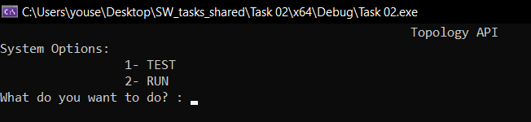
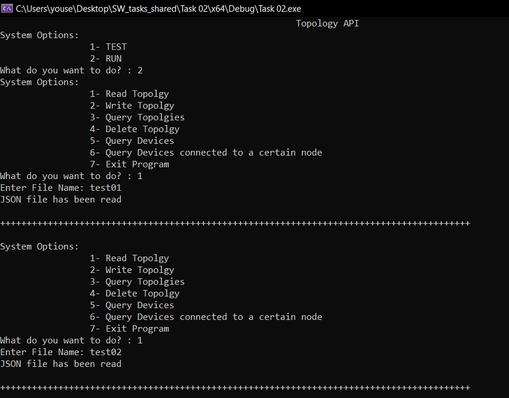
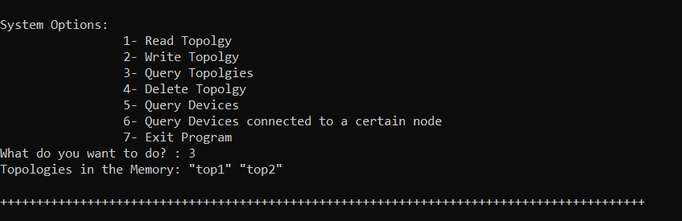
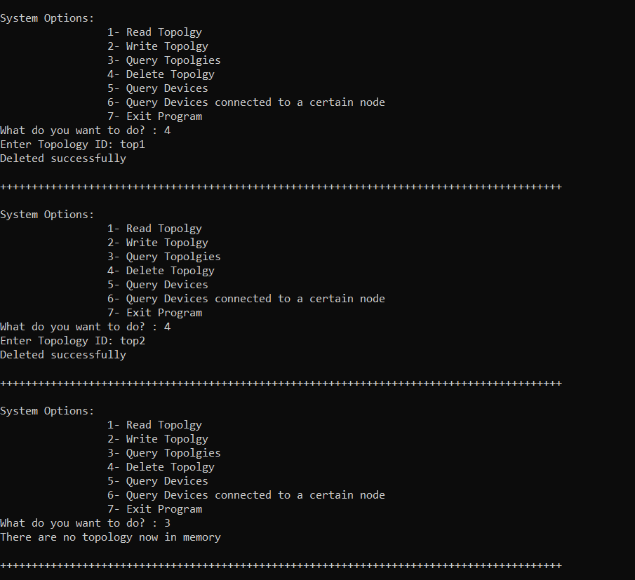
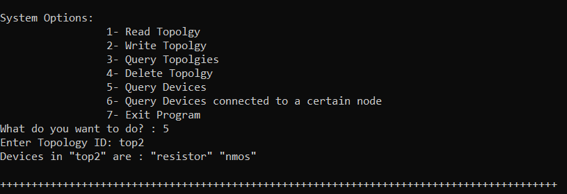
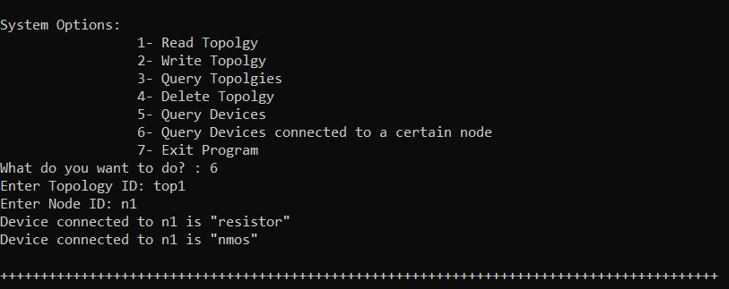
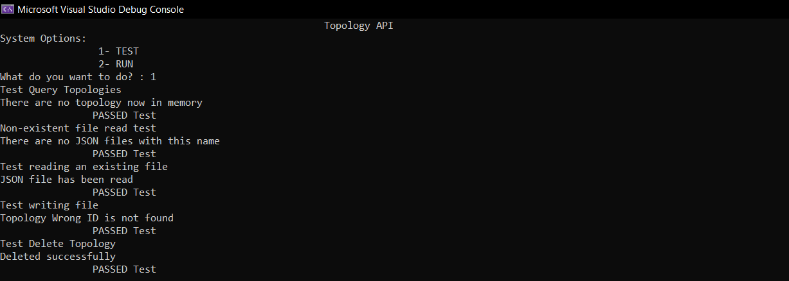

# Task-02(Topology API)

Master Micro's task to test programming skills for summer internship applicants

An API library which provides the functionality to access, manage and store device topologies.
## Built Using 
- **C++**
- **nlohmann-json.hpp** 
- **PVS-Studio**
- **Doxygen**

## Description
1. Read a topology from a given JSON file and store it in the memory.
2. Write a given topology from the memory to a JSON file.
3. Query about which topologies are currently in the memory.
4. Delete a given topology from memory.
5. Query about which devices are in a given topology.
6. Query about which devices are connected to a given netlist node in
   a given topology.
   
   ## Classes
### Main

* This class creates an object from the ApplicationManager class which is used to Execute each functionality

### Topology

* Abstract class with pure virtual function to acheive Polymorphism
 
 
### API

This class contains the memory of the API as a HashMap and an addToMemory function to store in it.

* This class contains the functions of the API :-
	* bool readJSON(string FileName) 
	* bool writeJSON(string TopologyID)
	* json* queryTopologies() = 0;
	* bool  deleteTopology(string TopologyID)
	* void queryDevices(string TopologyID)
	* void queryDevicesWithNetlistNode(string TopologyID, string NetlistNodeID)
	 
### Testing

* This class tests each function of class API

## Documentation
* See [Documentation folder](https://github.com/Yousef-Rabia/Task02-Topology-API/tree/master/Documentation) Created by Doxygen.
* If you want a PDF Documentation please click [Here](https://drive.google.com/file/d/1CPBmBkBu1Byr7PXc22M7lgW9iJaZJTqw/view?usp=sharing)
## Analysis
* See [Analysis folder](https://github.com/Yousef-Rabia/Task02-Topology-API/tree/master/Code%20analysis%20with%20PVS-Studio) Created by PVS-Studio.

##  Screenshots
#### Interface

#### Read JSON file 

#### Write JSON

#### Query Topologies

#### Delete a topology 

#### Query devices in a topology

#### Query devices with netlist node

 

#### Testing

